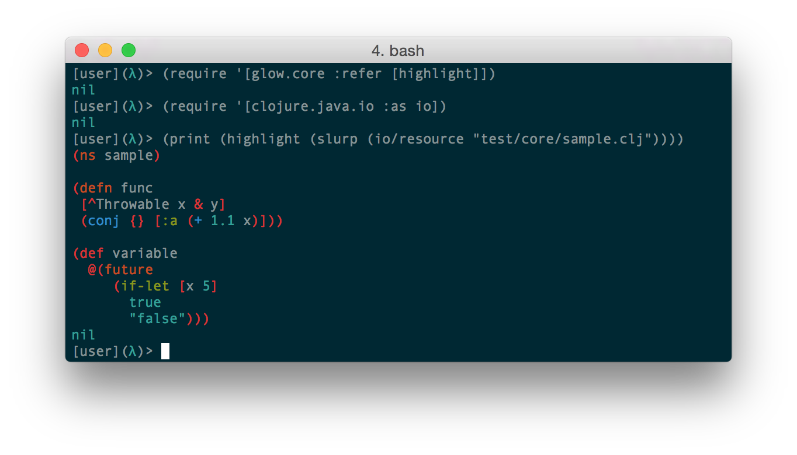
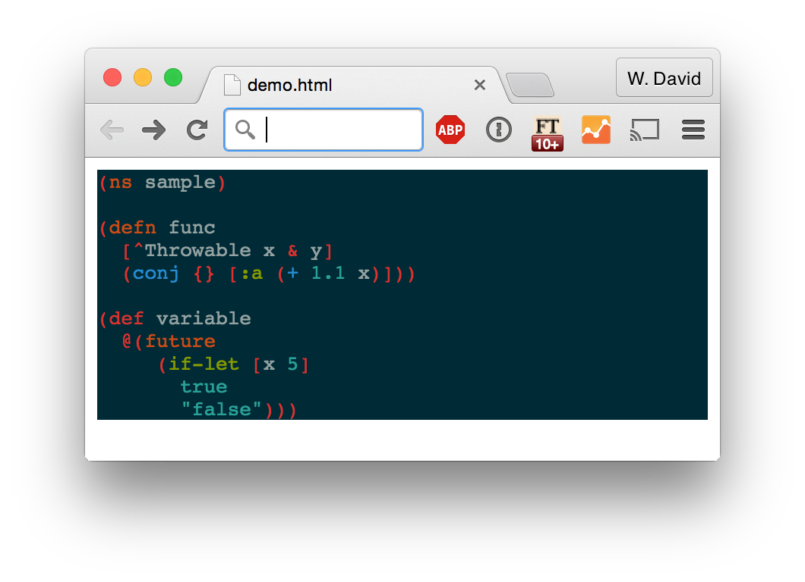
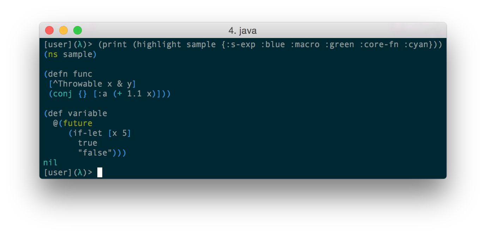

# Glow

[](https://travis-ci.org/venantius/glow)

A Clojure library for generating syntax-highlighted strings of Clojure source
code. Glow is capable of generating both ANSI-escaped strings for terminal
applications, and HTML/CSS targets for server-side generation syntax-highlighted
templates.

## Installation

To use Glow in your project, just add the following to the `:dependencies` key of your `project.clj`:

```clojure
[venantius/glow "0.1.6"]
```

## Usage

Usage is fairly straightforward.

Let's say you've got a Clojure file with the following contents:

```clojure
(ns sample)

(defn func
 [^Throwable x & y]
 (conj {} [:a (+ 1.1 x)]))

(def variable
  @(future
     (if-let [x 5]
       true
       "false")))
```

### ANSI-escaped Syntax Highlighting

To generate an ANSI-escaped string of source code, all we have to do is slurp
that file and pass the string to `glow.core/highlight`:



Nice.

### Server-side HTML/CSS Syntax Highlighting

The two relevant functions you'll want are `glow.core/highlight-html`, and
`glow.core/generate-css`. Glow's styling here is compatible with Pygment
stylesheets.

The API is very similar to terminal highlighting, but you'll need to generate
both the CSS and the HTML separately and link them appropriately within your site.

For an example, see `glow.html-test/generate-demo-page`, which generates the
following:



## Configuration

Don't like the default colorschemes? No problem!

Pass a map with whatever highlighting options you want as an optional
secondary argument:



Take a look at the colorschemes in `glow.colorschemes` to see how this should be structured.

## Contributing

In general, bug reports, fixes, and code cleanup are always appreciated. I'd
also love PRs for additional colorschemes, particularly for HTML output.

Feature requests are liable to be subject to a bit more discussion.

When filing issues, please include the following:

 * The operating system
 * The JDK version
 * The Leiningen version
 * The Clojure version
 * Any plugins and dependencies in your `project.clj` and your `~/.lein/profiles.clj`

## Special Thanks

I owe a big debt of gratitude to the authors, contributors and maintainers of [vim-clojure-static](https://github.com/guns/vim-clojure-static) for their lists of keywords. I also owe thanks to Alex Engelberg and Kyle Kingsbury ([@aphyr](https://github.com/aphyr)) - the former helped me work on an EBNF grammar for Clojure, and the latter for writing [clj-antlr](https://github.com/aphyr/clj-antlr). Lastly, thanks to Reid Mckenzie, who authored the Clojure antlr v4 grammar upon which Glow's grammar is based.

## License

Copyright © 2019 W. David Jarvis

Distributed under the Eclipse Public License 1.0, the same as Clojure. Parts of the ANTLR code are covered by the BSD license, and the original grammar used for the parser is MIT-licensed. Sorry for giving you three licenses in one go.
